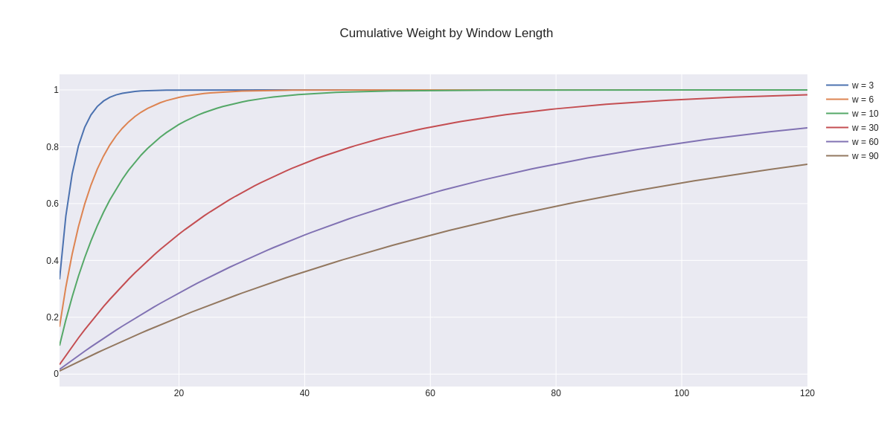
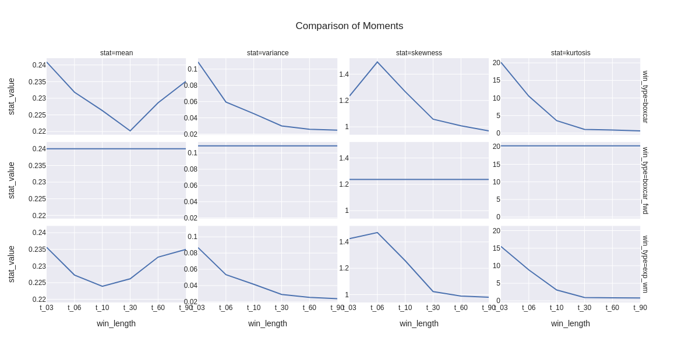
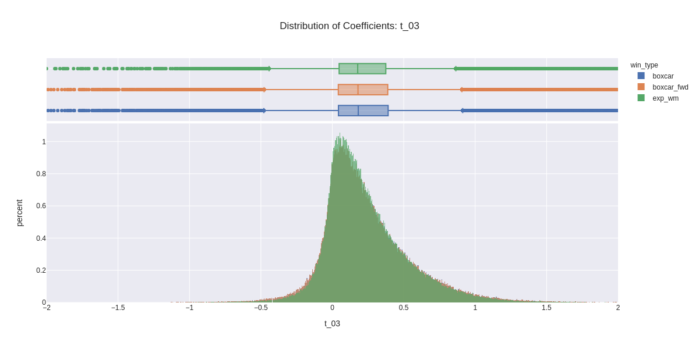
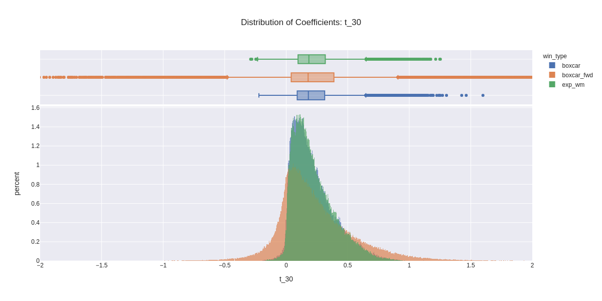
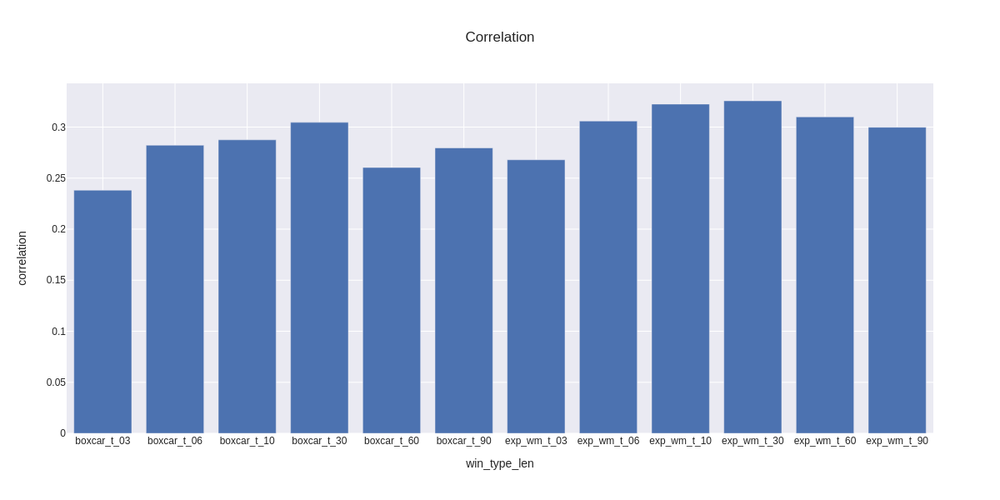

# FINM33150 - Rolling Regressions

## Dependencies

Create a virtual environment and install dependencies with

    pipenv install

## Summary
In this assignment we calculate regression coefficients for daily returns of 210 individual equities versus the market derived from exponentially weighted and boxcar widows of various lengths and compare them to coefficients calculated from a forward boxcar window. Our basis for comparison is that the coefficients calculated from the forward boxcar window are the "correct" coefficients and we therefore endeavor to determine which set of historical coefficients are most similar. To determine similarity we perform the following analyses across window methodology and length.

* Compare moments
* Compare histograms
* Compare correlations

Returns are calculated from daily adjusted closing prices for the period from 2016-01-01 to 2020-12-31 for 210 equities that meet the criteria from the quantile trading assignment. We establish weights for the exponentially weighted windows based on characteristic times of 1𝜆 ranging from 3 to 60 observations (our analysis makes the simplifying assumption that the duration between observations is the same). Historical boxcar windows lengths are calculated as 2𝜆 and range from 6 to 120 observations. In order to have one historical boxcar window length with the same length as the forward window, we set the length of the forward boxcar window at 6 observations instead of 5.

## Beta Calculation
We calculate betas for each equity for each observation for each window type for each window length (1.3 million in total). We do this by using the rolling covariance matrix function in pandas to get the covariance versus SPY and the variance for each ticker and then calculate betas directly as 𝛽̂ =Cov(𝑥,𝑦)/Var(𝑥).

## Compare Weights
The chart below shows the normalized cumulative weight for each of the exponentially weighted window lengths through 120 days. The main point is that observations well past the time 𝑡 continue to impact the moving average. In general, observations greater than 𝑡 comprise approximately 35% of the statistics. Given a boxcar window length of 2𝜆 for 10 observations of 20, for example (𝜆=0.1), the equivalent exponentially weighted window affords approximately 13% of its weight to observations greater than 20.

## Compare Moments
This is a dense chart, but allows us to compare the betas for the various combinations of window type and window length from one chart with y_axes for each statistic on the same scale. The moments are across the columns and the rows by window type. Note that the window length for all of the length labels for the forward box car window is 6 observations to facilitate comparison with the other window methods at varying lengths.

Variance decrease significantly with window length, as we would expect given the larger number of observations included in the longer windows.

* Mean beta decreases as window length increases as a result of covariance decreasing at a faster rate than the variance in the denominator (variance of equity and market decrease as window length increases, covariance in the numerator is akin to the product of the variances versus just the variance by itself in the denominator). What's interesting is that the mean beta actually starts to increase again for the window lengths greater than 30. I'm not sure why this would be since the variance is still decreasing.
* Kurtosis decreases with window length similarly to variance.
* By design, the statistics for the boxcar and forward boxcar windows of length 6 (t_03) are nearly identical (but for the lag of 6 days).
* For the shorter windows, the mean beta for the exponentially weighted windows is less than it is for the boxcar windows, likely related to the effectively greater number of observations included in the exponentially weighted windows and the relative impact on covariance versus variance.

## Compare Distributions
Here we plot distributions of coefficients for each window length. The range has been limited to betas of with an absolute value less than two in order to make differences in order to focus on differences in the core distributions, although there are outliers with absolute values greater than 8 in the t_03 window duration. Note again, that the forward boxcar window length is the same in each plot at 6 observations.

* We can see the reduction in variability and outliers as window length increases.
* If we were just trying to match the shapes of the distributions, the shortest window duration, which matches the duration of the forward boxcar window appears to be the most similar.
* It is interesting to note that the reduction in skewness as the window durations increase. Per the discussion in lecture, this would seem to be consistent with the idea that betas are in fact positive over the long run.
We also see starting in the t_10 plot that the boxcar window appears to have more outliers in it.

## Compare Correlations
Lastly, we analyze correlation between the series of coefficients. If we were concerned with matching the series of coefficients, i.e., the ewm and boxcar series for a particular window length to the next forward boxcar window, the merely analyzing the distributions would be insufficient since the distributions do not take order into account. As a case in point, the distributions of the forward boxcar window and rearward looking boxcar window of 6 observations are nearly identical, yet when we look at the correlation below, we see that they are the least correlated. The highest correlation was actually with the exponentially weighted window of 30 days with a correlation of 0.326.

